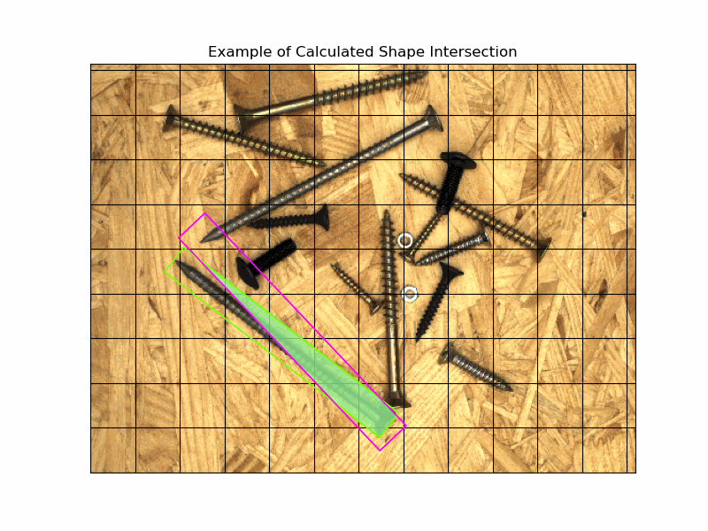
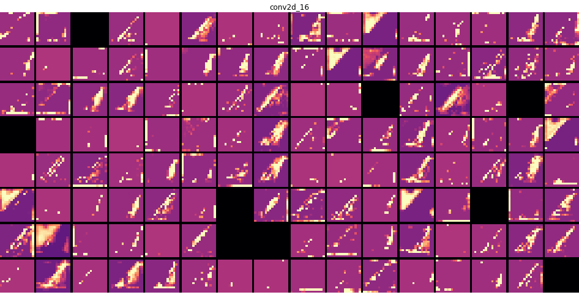
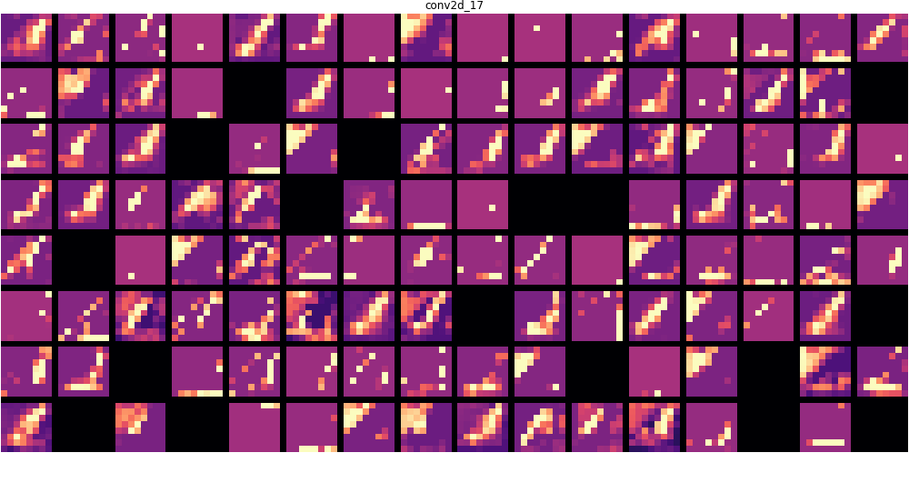

# Object Detection and Classification of Screws
The goal of this project is to use a dataset of photographs to train a model to detect and identify
an assorment of screws and nuts. The dataset was taken from the MVTec Screws Dataset. Object
detection is a challenging problem in machinelearning and continues to be a very active area of
research with new algorithms and processes being developed regularly.

## Business and Stakeholder Understanding
The stakeholders for this project are medium sized manufactures who handle custom fabrication builds
in multiple industries. They businesses that take work in traditional architectural fabrication
as well as custom fabrication projects for any client and can build anything from corporate trade 
show displays, to hollywood movie sets.

The client for this project is a small technology start-up. They are developing products that aim
to reduce cost and improve efficieny in small to medium sized manufacturing businesses. The model
developed will hopefully be used in a sorting machine that can identify common construction hardware
and sort it by type.

The volume of output at large manufacturing firms makes this type of tool
impractical and the cost of wasted or unused hardware is outweighed by the efficiency of most
mass-production processes. For small to medium sized businesses waste and/or the time spent recliaming
unused hardware and material can represent a significant drag on profitability. The client hopes
to use modern technologies including machinelearning to provide products and services that help
improve profitability for small businesses in the manufacturing industry.

## Data Understanding




<p style='text-align: center;font-size:12px;color: gray;'><i>Pictured Above are output filters from the convolution layers used in <strong>Model 1</strong></i></p>
</br>
</br>
<p><strong>The Dataset</strong> for this project consists of several hundred images of around 4500 thousand pieces of
construction hardware belonging to 13 different classes. The mostly represent types of common screws
however the images also contain nuts of varying sizes. Each size and type of hardware belongs to
its own class.</p>

### Exploratory Data Analysis
<p>The data is structured in a format similar to the COCO dataset standard. It is derived from a
proprietary format belonging to the dataset originator, MVTec. The images are very standardized
each depicting a different configuration of randomly assorted pieces of hardware. There is broadly
no major class imbalance however individual images can contain anywhere from 10 to 20 parts of
5 to 10 classes.</p>

### Data Cleaning/Preparation
<p>The data presented several challenges when preparing it for training. The bounding-box format was
similar to the COCO format but did not seem to match what most plug and play tool chains expected.
This meant reworking the data multiple times and in a multitude of ways.</p>

Data manipulation led to the writing of several custom tools to handle various aspects of preparing
the data. These included:
* Tools to create coordinate points for bounding box corners from the row, col, width, height, angle format in the data.
* Tools to create compatible label formats for training.
* Tools to calculate IoU and GIoU for unaligned bounding boxes.
* Tools to provide necessary calculations from the label data to the loss function of a YOLO-like model.

## Modeling
### Model 1

<p>Because of complications with the dataset and the complexity of object detection compared to my prior
machine-learning experiement I started off with a simple classifier model. Using the toosls developed
during the EDA and preparation process I split the dataset into many images of individual screws
by croping each object out of the original images and recording their class. </p>


<p>I then wrote, trained and tested a simple classification model. This model did well at classifying
the dataset, scoring around a 97% percent accuracy after only a few epochs. It consisted of a few
convolutional blocks that feed two fully-connected dense layers that output the class probabilities.</p>

### Model 2

<p>My second iteration of the model attempted to use a model structure similar to an Autoencoder. Using
the bounding box labels from the dataset to make pixel masks of the classes I then tried several
different configurations to get the model to predict the class labeled masks from each image.</p>

<p>In this configuration the model was (theoretically) attempting to create the pixel mask from the
original image. I tried passing the labels as both a 13 channel pixel array (one channel for each
class) and as flattened image array with one channel but class ids for each labeled class.</p>
</br>
</img>
<span style="display:block; text-align:center;font-size:12px; color: gray;"><i>Above: visualizations of mask layers that the model tried to derive from the original images</i></span>
</br>
Neither approach was very successful. The model would learn some amount of correlation between the
screws and the boxes but was not effective at separating these into class labels. It was also very
prone to overfitting and the validation predictions could become chaotic very quickly.

### Model 3 - WIP

<p>After spending a significant amount of time researching image detection methods and algorithms I
decided to try to implement a simple version of the YOLO algorithm with my dataset. The time and
thought required to do this was considerable. At the time of writing this it is still a work in
progress, however, I can discuss the progress I made and the things I learned about how this class
of image detection algorithms works.</p>

<p>A concept that was difficult for me to get a handle of early in my research was the way that YOLO
splits and image into grid cells and then performs image detection within each cell. Other algorithms
like fast RNN models perform image detection by using convolutional layers to identify areas of
interest in the image and then litrally splitting those areas of the image off into separate model
architectures to perform class and bounding box prediction.</p> 

<p>The YOLO algorithm 'splits' the image into a grid but does so through convolutional layers that
that decrease the dimensional size of the image, but increase feature depth as the network progresses.
So you may start with an image size of 416 x 416 and perform many convolutions on it until it is
size 7 x 7 (for the original YOLO model the grid was 7 x 7). At the bottom of your convolution layers
you end up with an output that is 7 x 7 x 512 or 1024 per image.</p>

<p>What then happens is at each cell in the grid a set of 'anchor boxes' are introduced. These anchor
boxes are represented by a predeterimined set of dimensions. This is similar to the Single Shot
Detection algorithm. However, SSD generally uses a set of hand coded intialization values for the
anchor boxes and it is customary in YOLO to use the KMeans clustering algorithm to choose bounding
box initialization values.</p>

<p>Being a visual and tactile learner, this concept was relatively difficult for me to understand. The
convolutions perform a kind of feature abstraction and condensation into a size that relates to the
"grid" but at no time is the image actually split. Instead, values representing these anchor boxes
are introduced in a set of linear or fully connected dense layers. A method called non-max suppression
is used to remove values of anchor boxes that do not fit the label data or fall only over background
portions of the image. The best fitting boxes are then passed to the loss function that adjusts the
weights of the model, including the anchor box initializations, to better fit the label data.</p> 
<div style="text-align: center;">
</img>
</div>
<span style="display:block; text-align:center;font-size:12px; color: gray;"><light><i>Above is an illustration of the anchor boxes calculated by KMeans Clustering and drawn at each cell of the imaginary grid</i></light></span>
<div style="text-align: center;">
</img>
</div>

<p><strong>Current versions of the YOLO algorithm</strong> also perform multiple prediction loops by predicting on the 
convolutional output at one size and grid configuration and then upsampling the feature set and
performing another prediction at a denser grid and anchor box configuration. This is upsampling
and prediction can be performed multiple times. The purpose of it is to increase the diversity of
the sizes' of objects that the model can detect. A model with a dense grid will be better at predicting
small objects while a grid of size 7x7 or 13x13 is better for large objects.</p>

<p>Several challenges arose while attempting to implement YOLO from scratch in Keras.</p>

<p>The first, and an obstactle that kept me from using other more plug and play tools for bounding
box detection was that the size distribution, density of placement and natural shape of the objects
I was attempting to detect did not lend itself well to more straight-forward bounding box methods.</p>

<p>The screws are long and thin proportinoally and the dataset included bounding box labels that fit
well around each object but did so by aligning the long access of the box with center axis of the
screw shaft. I did not see any publicly available model structure that predicted angle as part of
the bounding box values.</p> 

<p>It may be the case that much of this won't, or shouldn't matter in predicting the orientation, but
starting out I think I was thinking very much in a literal way about the visual representation of
the boxes and did not know what or how this angle parameter would effect the model output.</p>

<p>So, the angle parameter introduced a level of complication into every aspect of working with this data.
Although, it's fairly trivial to adjust the coordinate positions given for each box to an orientation
that matches the angle. However, I did not see any examples of YOLO implementations (or any boudning
box prediction algorithm) that incorporated a box alignment.</p>

The label format for this model ends up being structure like this:


<p>Working through the complications with calculating IoU for rectangles without parallel orientations,
finding points that fall inside arbitray convex polygons and calculating the area of a the
polygon is formed by the intersecting rectangles, and doing all of that with tensor data where there
were several thousand entries each with possibly different configurations of intersection or no
intersection was a extremely fun and engaging, but took me almost 4 days to complete.</p>

<p>At each step I enountered a new concept to learn. For instance, learning that taking the determinant
of a 3 x 3 matrix returns its planar area was super cool and very useful. Once I had calculated the points
making up the shape of intersection between a label and prediction I split each into sets of two
points and a third representing the center of the shape. I could then take the deterimnant of each
three point set (times 1/2) and sum them to find the area of the polygon.</p>

<p>I became much more comfortable using the tensorflow/numpy API and have become really fascinated
with how matrices remove any need to write for-loops in python. Simply working out how to structure 
the data and in what order to perform operations sufficed to do almost every operation I needed to 
for taking a tensor of labels and one prediction and calculating any related value between them I
needed for the eventual implementation of the loss function.</p>
    

<div style='display:block;margin-left:0;margin-right:auto;text-align: left; '>

</div>


<p style='text-align: left; '>


</p>
<p style='text-align: left; '>


</p>
</br></br><p>All that to say. I had fun, but I did not finish before writing this README. I have finished the
tensor operations necessary to get the GIoU and IoU from a set of labels and predictions, and I
am working on implementing the anchor box layer. I have written and tested the KMeans clustering
generator for the anchor sizes and orientations. However, I have not yet written the actual loss
function layer for Keras, or a non-max suppression layer.</p>

Those are the next steps and I will update this repo as I finish them over the next week or so.

All of this is super fun and interesting to learn. 

### Model 4 - Final Model

<p>For my final object detection attempt I used a YOLO implmentation written with Darknet. Darknet is
a NN framework written in C and provides a python api and many versions of models with trained 
weights. I am using the YOLOv3 implementation in darknet and trained it using a set of weights from
COCO and my own data. </p>

<p>It was relatively easy to set up and get training. There were small adjustments I need to make to
my dataset and simple scripts to translate my labels to a format darknet will accept. In order to
use this framework I removed the angle parameter from the labels and recalculated the points to 
match what darknet expects.</p>

## Conclusions 

<p><strong>Although this project</strong> has been difficutl to get into a strong place performance-wise
I am extremely satisfied with the progress and expreince I have gotten while working towards its
completion. There is still a little ways to go, but I am excited to bring the knowledge and skills I
have learned thus far to tackling the final stretch. The idosyncracies in the dataset have comlicated
most of my attempts at finding the solution with the straightest path to completion, but thanks to
that process I feel that I have gained real experience and knowledge in an area of machine-learning
that I am deeply interested in pursuing further.</p>

```bash
./
├── data
│   ├── images
│   │   ├── test
│   │   ├── train
│   │   └── val
│   └── yolo_v3
│       └── obj
├── images
├── notebooks
├── src
│   ├── models
│   │   └── __pycache__
│   ├── __pycache__
│   └── utils
│       └── __pycache__
└── uploads
    └── images
```
